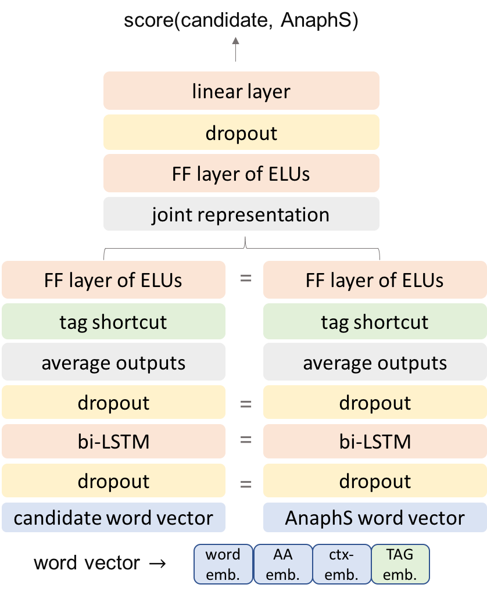

# A Mention-Ranking Model for Abstract Anaphora Resolution
Resolution of anaphors that refer to propositions, facts, events or properties 

Ana Marasovic, Leo Born, Juri Opitz, and Anette Frank (2017): [A Mention-Ranking Model for Abstract Anaphora Resolution](http://aclweb.org/anthology/D17-1021). In Proceedings of the 2017 Conference on Empirical Methods in Natural Language Processing (EMNLP). Copenhagen, Denmark.

<p align="center"></p>

## Requirements

- [tensorflow 0.12](https://www.tensorflow.org/versions/r0.12/)
- [nltk](http://www.nltk.org) 
- [gensim](https://radimrehurek.com/gensim/)
- [matplotlib](https://matplotlib.org)
- [scikit-learn](http://scikit-learn.org/stable/)
- [hyperopt](https://github.com/hyperopt/hyperopt)


## Instructions

- use `main.py`, `train.py`, `models.biLSTM_SiameseMR.py` to train the model for shell noun or abstract anaphora resolution 
- use `main_tuner.py`, `train_tuner.py`, `models.biLSTM_SiameseMR.py` to tune HPs
- use `eval.py` to get figures

## Data

Check this [repo](https://github.com/amarasovic/abstract-anaphora-data).

## Reference

If you make use of the contents of this repository, please cite [the following paper](https://arxiv.org/abs/1706.02256):

```
@InProceedings{D17-1021,
   author={Marasovi\'{c}, Ana and Born, Leo and Opitz, Juri and Frank, Anette},
   title = "A Mention-Ranking Model for Abstract Anaphora Resolution",
   booktitle = "Proceedings of the 2017 Conference on Empirical Methods in Natural Language Processing (EMNLP)",
   year = "2017",
   publisher = "Association for Computational Linguistics",
   pages = "221--232",
   location =  "Copenhagen, Denmark",
   url = "http://aclweb.org/anthology/D17-1021"
  }
```

